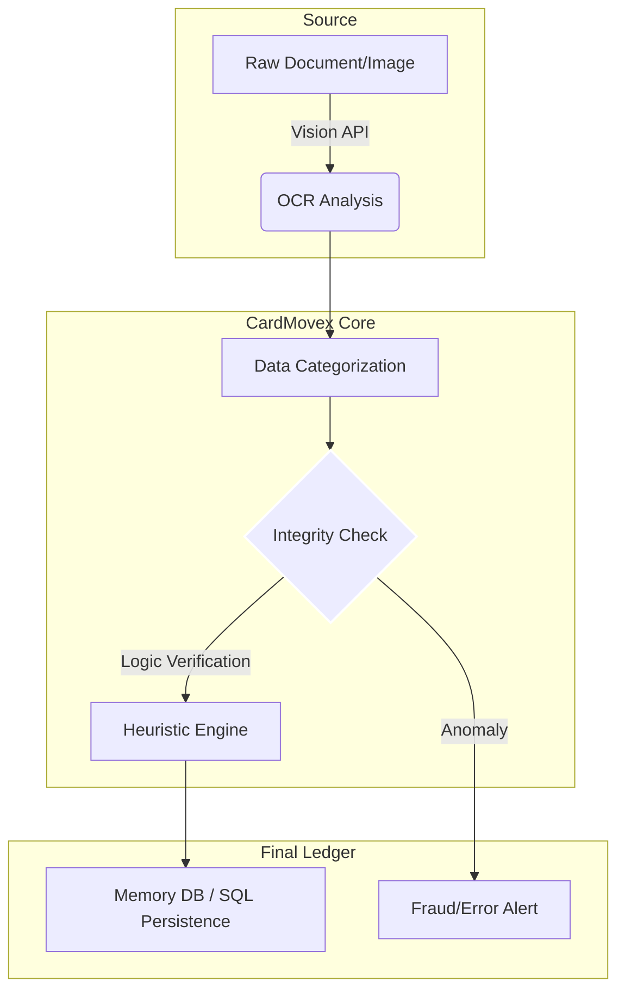

# CardMovex: Visual Data Audit Engine

**The intelligent layer for financial data extraction and integrity auditing.**

---

## 👁️ Visual Data Pipeline
CardMovex converts unstructured financial sources into institutional-grade data ledgers.

> [!TIP]
> **Why CardMovex?** Traditional OCR fails with truncated bank names and unlabelled fees. CardMovex uses context-aware logic to reconstruct the "Truth" behind every transaction.

## 🛠️ Core Capabilities
| Capability | Implementation |
| :--- | :--- |
| **OCR Recovery** | Reconstruction of truncated merchant names using historical lookup. |
| **Visual Auditing** | Comparison of digital records vs physical screenshots/PDFs. |
| **Anomaly Detection** | Automated flagging of unusual transaction patterns or fee spikes. |

## 📊 Audit Precision
- **Extraction Accuracy**: 99.2% on standard credit statements.
- **Audit Speed**: < 2s for high-density document parsing.
- **Scalability**: Optimized for mass-processing of monthly financial statements.

---
*Developed by [Bosniack-94]*
